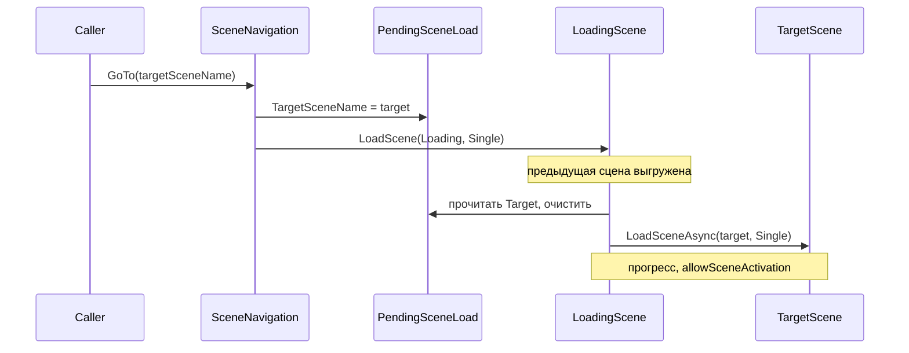

# Переходы между сценами и экран загрузки

Документ описывает, как в проекте Shattered Forge устроены переходы между сценами через лёгкую сцену **`Loading`**, и как правильно вызывать навигацию из кода.

## Зачем отдельная сцена загрузки

- Текущая тяжёлая сцена (например, меню с IMGUI и данными профилей) **выгружается** до того, как начнёт активироваться следующая.
- Асинхронная загрузка целевой сцены идёт уже из **минимальной** сцены `Loading` — меньше пик памяти и предсказуемее кадры.
- Один вход **`SceneNavigation.GoTo`** — проще поддерживать и не дублировать корутины с `allowSceneActivation` в каждом экране.

## Поток данных



1. Вызывается **`SceneNavigation.GoTo("ИмяЦелевойСцены")`**.
2. Имя цели сохраняется в **`PendingSceneLoad.TargetSceneName`**.
3. Выполняется **`SceneManager.LoadScene("Loading", LoadSceneMode.Single)`** — активируется только сцена загрузки.
4. **`LoadingSceneController`** в сцене `Loading` читает pending, проверяет, что сцена есть в Build Settings, затем **`LoadSceneAsync`** на цель с привычным порогом **`progress < 0.9f`** и **`allowSceneActivation`**.

## Публичный API

| Элемент | Назначение |
|--------|------------|
| **`SceneNavigation.GoTo(string targetSceneName)`** | Основной способ перейти на другую сцену билда через `Loading`. |
| **`SceneNavigation.GoTo(string target, string loadingScene)`** | То же, но имя сцены загрузки переопределяется (тесты / инструменты). |
| **`SceneNavigation.IsBusy`** | `true` после успешного `GoTo` до сброса внутри слоя загрузки; можно использовать, чтобы не дублировать клики. |
| **`SceneNavigation.ResetBusy()`** | Сброс флага занятости; обычно вызывается из **`LoadingSceneController`**, не из игрового кода. |
| **`SceneNames`** | Константы имён сцен (`Boot`, `Loading`, `DefaultMenu`, …) — добавляйте новые цели сюда, чтобы не размазывать строки по проекту. |
| **`PendingSceneLoad`** | Внутренний буфер между `GoTo` и `LoadingSceneController`; снаружи не пишите, только через `GoTo`. |

Пример из меню в геймплей:

```csharp
using ShatteredForge.SceneFlow;

// …
SceneNavigation.GoTo("GameplayScene"); // или SceneNames + константа, если добавите
```

## Требования к сценам

1. **Имя сцены** — как в **File → Build Settings** (без расширения `.unity`), например `GameplayScene`, `SampleScene`.
2. Сцена **обязательно** должна быть в списке билда (`Editor Build Settings`), иначе `LoadingSceneController` покажет ошибку и кнопку возврата в меню.
3. Сцена **`Loading`** (`Assets/Scenes/Loading.unity`) должна оставаться в билде между меню и тяжёлыми сценами — порядок в списке не влияет на `LoadScene`, но удобен для людей.

Текущий типичный порядок в проекте: **Boot → SampleScene (меню) → Loading → GameplayScene**.

## Сцена Boot (не через Loading)

**`Boot`** — отдельный «холодный старт»: свой визуал и переход **`LoadSceneAsync`** напрямую в меню (`SampleScene`). На неё **не** распространяется правило «всегда через `SceneNavigation`» — это осознанное исключение.

Подробнее о поведении Boot см. код **`BootSceneController`**.

## Сцена Loading (что не делать снаружи)

- Не открывайте сцену **`Loading`** напрямую из геймплея/меню для обычного перехода — теряется запись в **`PendingSceneLoad`**, и контроллер уйдёт в fallback (меню) или ошибку.
- Не вызывайте **`SceneManager.LoadScene(target)`** для типичных переходов «меню ↔ игра» — обходите единый UX и снова тянете тяжёлую сцену вместе с загрузкой.

Исключения по смыслу: **Editor**, тестовые сцены, аварийный fallback внутри **`LoadingSceneController`**.

## Расширение (прогрев до активации)

В **`LoadingSceneController`** зарезервирован хук **`RunOptionalWarmup()`** (пустой `yield break` в базовой версии). Сюда позже можно добавить прогрев Addressables / шейдеров **после** `op.progress >= 0.9f` и **до** `allowSceneActivation = true`, не меняя публичный **`SceneNavigation.GoTo`**.

## Связь с правилами Cursor

В репозитории есть правило **`.cursor/rules/shattered-forge-scene-transitions.mdc`**: при правках скриптов под `Assets/Scripts/**` агенту напоминают всегда использовать **`SceneNavigation.GoTo`** для переходов между сценами билда.

## Краткий чеклист

- [ ] Переход между сценами билда → **`SceneNavigation.GoTo(...)`**.
- [ ] Новая целевая сцена добавлена в **Build Settings**.
- [ ] Имя сцены совпадает с константой / строкой в инспекторе.
- [ ] При необходимости блокировки повтора — проверка **`SceneNavigation.IsBusy`** до вызова `GoTo`.
